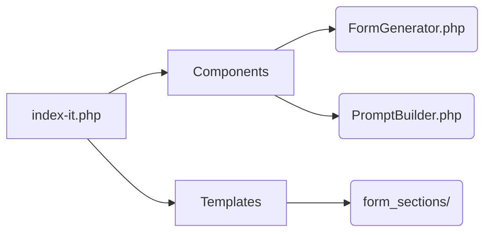

# WordPress Plugin Prompt Generator Architecture

## Current Architecture Analysis
- **Monolithic Structure**: Single-file implementation (2950+ lines)
- **Security**: No input sanitization or CSRF protection
- **Maintainability**: Hardcoded text/UI elements
- **AI Integration**: Static prompt construction
- **Performance**: Unoptimized assets
- **Extensibility**: Rigid feature set

## Proposed Improvements

### 1. Modularity Refactor

### 2. Security Enhancements
- Input sanitization layer
- CSRF token implementation
- Output escaping for generated content

### 3. Maintainability Upgrades
- Internationalization (i18n) system
- Configuration manager
- Separation of concerns

### 4. AI Integration Improvements
- Parameterized prompt templates
- Dynamic feature formatting
- Template inheritance system

### 5. Performance Optimizations
- Asset build pipeline (PostCSS/Tailwind)
- Caching headers
- Lazy loading for UI components

### 6. Extensibility Framework
- Template registry pattern
- Hook-based extensions
- Plugin architecture for new features

## WordPress Standards Compliance
- Enforce WordPress coding standards in generated plugins
- Implement security best practices:
  - Nonce verification
  - Capability checks
  - Input sanitization
- Add PHPDoc blocks to all PHP functions

## Implementation Roadmap

1. **Phase 1: Core Refactoring**
   - Separate HTML/CSS/JS/PHP concerns
   - Implement input sanitization layer
   - Create i18n foundation

2. **Phase 2: AI Integration**
   - Develop PromptBuilder class
   - Create template registry
   - Implement parameterized prompts

3. **Phase 3: Performance & Extensibility**
   - Set up build pipeline (npm/postcss)
   - Create template inheritance system
   - Add hook-based extension points

4. **Phase 4: Testing & Optimization**
   - Implement unit tests
   - Add browser compatibility testing
   - Final performance tuning